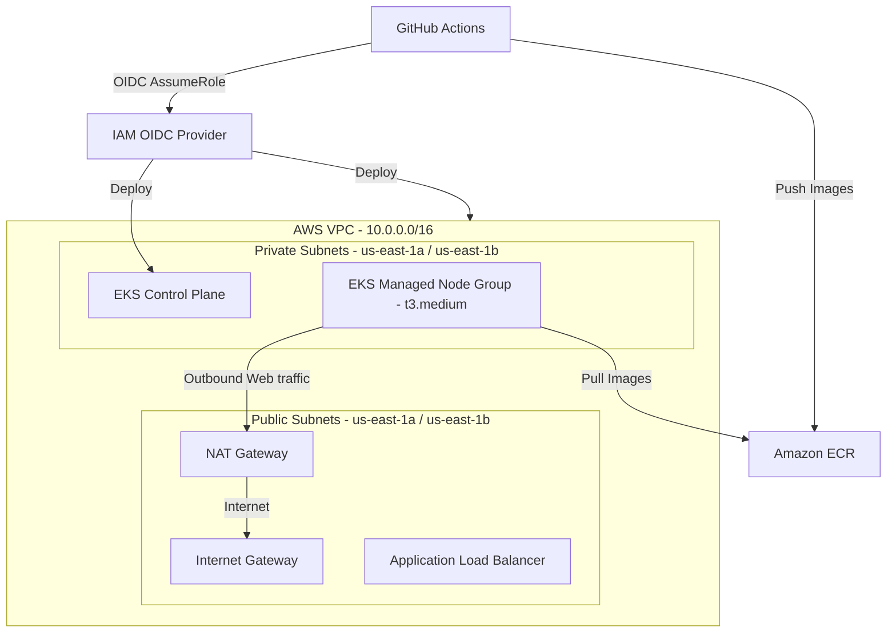

# EKS Infrastructure Configuration with Terraform

This directory contains the Terraform configuration files used to provision a secure, scalable, and production-ready infrastructure on AWS for deploying a Go application.

---

## Architecture Overview



---

## AWS Services Utilized

### 1. Amazon VPC (Virtual Private Cloud)
- **What it does**: Provides a logically isolated virtual network for your AWS resources.
- **Why we need it**: Security and isolation. The network is segmented into:
  - **Public Subnets**: Houses the NAT Gateway and Internet-facing Application Load Balancers.
  - **Private Subnets**: Houses the EKS Cluster control plane elastic network interfaces (ENIs) and your worker nodes. This ensures worker nodes are never directly exposed to the public internet.
  - **NAT Gateway (Network Address Translation)**: Allows instances in private subnets to connect to the internet (e.g. to pull ECR container images or fetch OS updates) while preventing the internet from initiating connections with those instances.

### 2. Amazon EKS (Elastic Kubernetes Service)
- **What it does**: A managed Kubernetes service that automates the deployment, scaling, and management of containerized applications.
- **Why we need it**: It manages the Kubernetes control plane (API server, etcd) automatically, ensuring high availability. 
- **Compute (EKS Managed Node Groups)**: Automatically provisions and lifecycle-manages EC2 instances (`t3.medium`) running **Amazon Linux 2023** (`AL2023_x86_64_STANDARD`) as Kubernetes worker nodes.
- **Access Config & Access Entries**: Uses the modern native `API_AND_CONFIG_MAP` authentication mode to associate IAM roles with Kubernetes RBAC groups securely without depending solely on legacy ConfigMaps.

### 3. AWS IAM OIDC Provider
- **What it does**: Establishes trust between AWS IAM and external Identity Providers (in this case, GitHub Actions).
- **Why we need it**: Allows GitHub Actions workflows to temporarily assume an IAM role (via Web Identity Federation) to perform Terraform changes and build container images, eliminating the need to store long-lived static AWS access keys inside GitHub secrets.

### 4. Amazon ECR (Elastic Container Registry)
- **What it does**: A fully managed Docker container registry.
- **Why we need it**: Securely stores the Docker container images built by the CI/CD pipeline. The worker nodes pull their application images directly from this registry.
- **Lifecycle Policy**: Configured to keep only the last **10** Docker images to optimize storage costs.

### 5. AWS KMS (Key Management Service)
- **What it does**: A managed service to create and control cryptographic keys.
- **Why we need it**: Used by EKS to automatically encrypt Kubernetes `Secrets` at rest inside `etcd`.

---

## Project Structure

```
iac/terraform/
├── backend.tf            # Backend configuration for remote S3 state and native locking
├── main.tf               # Root module orchestrating child modules (VPC, ECR, IAM, EKS)
├── vars.tf               # Root input variables declarations
├── versions.tf           # Terraform version and provider constraints
├── providers.tf          # Configures AWS provider settings
├── output.tf             # Outputs exported from the root configuration
├── environments/
│   └── dev.tfvars        # Environment-specific configuration values for Development
└── modules/
    ├── ecr/              # Child module managing Elastic Container Registry
    ├── eks/              # Child module configuring EKS, Managed Node Groups, and Addons
    ├── iam/              # Child module establishing GitHub OIDC trust and roles
    └── vpc/              # Child module building the VPC network layout
```

---

## Essential EKS Add-ons Configuration

The cluster manages the following **Kubernetes Add-ons** API resources via Terraform:
- **`vpc-cni`**: Standard AWS VPC Container Network Interface. Handles Pod IP address allocation directly from the VPC CIDR block. It has `before_compute = true` enabled, ensuring that pod networking is fully initialized *before* nodes spin up.
- **`kube-proxy`**: Manages network rules on nodes to allow network communication to your Pods.
- **`coredns`**: Handles cluster-internal DNS resolution.

---

## Deployment & Setup Reference

### 1. Variables (`dev.tfvars`)
Specify environment parameters inside `environments/dev.tfvars`. 
| Variable | Type | Description |
| :--- | :--- | :--- |
| `project_name` | `string` | Base name for all resources (e.g. `go-app`) |
| `environment` | `string` | Deployment environment tier (e.g. `dev`) |
| `aws_region` | `string` | Destination AWS Region (e.g. `us-east-1`) |
| `cluster_version` | `string` | EKS Kubernetes control plane version (e.g. `1.33`) |
| `instance_type` | `string` | EC2 instance size for worker nodes (e.g. `t3.medium`) |
| `vpc_cidr` | `string` | IP block for the entire VPC (e.g. `10.0.0.0/16`) |

### 2. Initialization and Validation
Initialize plugins and validate configuration locally without writing state:
```bash
terraform init -backend=false
terraform validate
```

### 3. Deploy Infrastructure
To run plan and apply (requires AWS credentials with access to the remote backend bucket):
```bash
terraform plan -var-file=environments/dev.tfvars -out=tfplan
terraform apply tfplan
```
